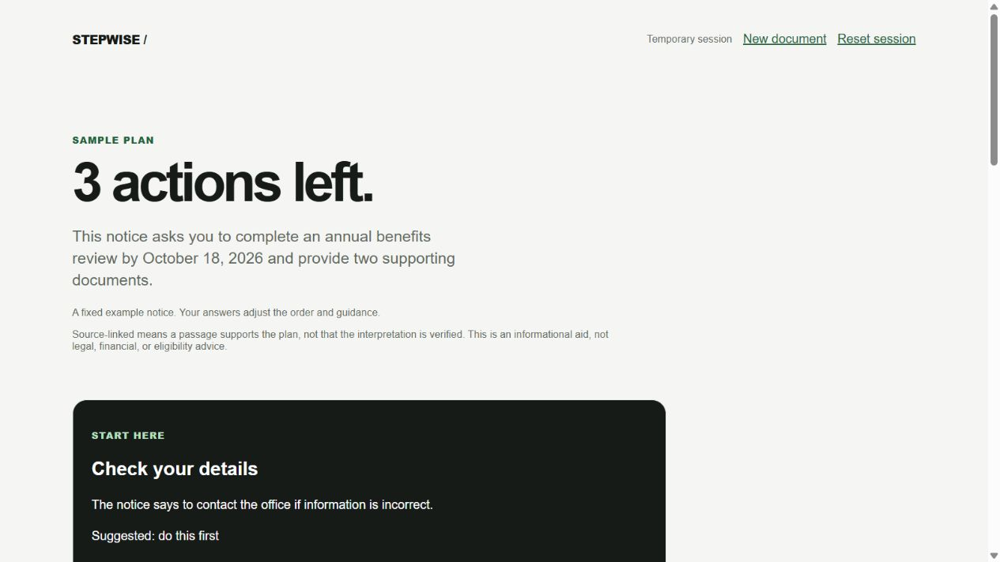

# StepWise

An administrative-notice checklist with inspectable source passages. The included fictional renewal notice runs without an account, API key, or paid service.



## Run the no-key demo

Install [Node.js 24 LTS](https://nodejs.org/) and Git, then:

```sh
git clone https://github.com/murodov-m/stepwise.git
cd stepwise
npm ci
npm run dev
```

Open [localhost:3000](http://localhost:3000) and choose **Try the sample**. Inspect a source, change a priority answer, complete a task, and start a new document. Sample output is a deterministic fixture, explicitly labeled in the app. It demonstrates the interaction and validation contract; it does not demonstrate a live model's quality.

To run a production build locally:

```sh
npm run build
npm start
```

## Optional live mode

Copy `.env.example` to `.env.local` and configure a server-side OpenAI-compatible chat-completions service:

```dotenv
AI_API_KEY=your-server-side-key
AI_BASE_URL=https://api.openai.com/v1
AI_MODEL=your-supported-model
```

Restart the server. The sample still works without these values. Live analysis sends extracted passages and a result contract to the configured service's `/chat/completions` endpoint. The configured model must return JSON matching that contract. Costs, quotas, retention, and model capabilities depend on that service. A real-provider evaluation has not been performed without credentials; tests cover the adapter using controlled responses.

Accepted live inputs: plain text or pasted text, text-bearing PDF, PNG, JPEG, and WebP. Limits: 8 MiB upload, 100,000 extracted characters, 40 PDF pages, 16 million image pixels, 30 seconds for extraction, and 30 seconds for analysis. Encrypted/corrupt PDFs and any PDF page without readable text are rejected, including otherwise legitimate blank pages. This conservative boundary avoids silently skipping a scanned requirement. Images use local English OCR with bundled language data and carry transcription warnings; other languages and scanned multipage PDF OCR are outside this proof of concept.

Live extraction requires a Node server that permits child processes. Full-install local `next start` is the supported production run; Edge runtimes and hosts that prohibit process spawning are unsupported. Standalone/serverless deployment has not been verified.

## Evidence and privacy boundaries

The server extracts source passages before contacting the analyzer. Returned quotes must match those server-owned passages. Model-invented source text cannot validate itself. Linking a quote establishes provenance, not factual interpretation, professional correctness, or the absence of an omitted detail. Read the original notice and contact its issuer when unsure.

Actions separate completion from evidence status. Required documents and confirmation warnings stay visible. Suggested dates are labeled separately from source deadlines. StepWise organizes information; it does not determine benefits eligibility or provide legal, financial, or medical advice.

The app has no accounts, database, document persistence, or analytics. Input and results live in temporary memory; clearing the session or reloading drops the browser's current state. The server does not log document contents. Live extracted text is sent to a third party, whose own retention policy applies. Avoid real sensitive documents when evaluating an unconfigured or unreviewed provider. Never commit `.env` files or keys.

## Verify

```sh
npm run lint
npm run typecheck
npm test
npm run build
npx playwright install chromium
npm run e2e
```

`typecheck` generates Next.js route definitions before checking TypeScript, so it works without a prior dev session or build and includes the framework's route contracts. `next-env.d.ts` and `.next/` are generated locally and excluded from public source.

Browser tests use localhost consistently, start their own server, and exercise the real no-key route. Provider-failure and alternative-result tests use controlled responses. [Verification evidence](docs/verification.md) records the results and limits.

## Project map and planning

- [Interactive code map](devpost/app-map.html) — open locally in a browser; no external assets.
- Official Devpost Learn Skill Pack outputs: [scope](devpost/scope.md), [PRD](devpost/prd.md), [spec](devpost/spec.md), [build checklist](devpost/checklist.md).
- `app/` and `components/`: input, temporary session, checklist, and source modal.
- `lib/domain/`: result contract, sample, dates, and answer-dependent priorities.
- `lib/server/`: independent extraction, external provider adapter, validation, and route processing.
- `tests/`: domain/server regressions and browser journeys.

The project was built with AI coding assistance, including Superpowers and the official [Devpost Learn Skill Pack](https://github.com/challengepost/learn-ai-basics). The fictional sample and application styling are project-created; dependency and asset attribution is in [third-party notices](docs/third-party-notices.md).

MIT licensed; see [LICENSE](LICENSE).
